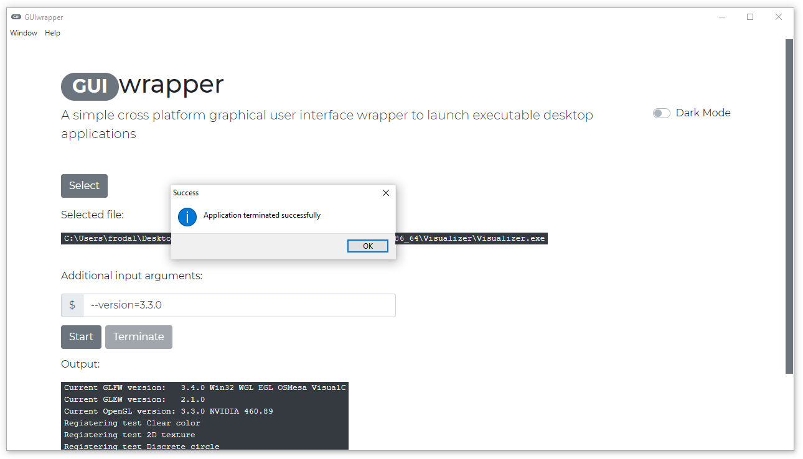

# GUI wrapper

A simple cross platform graphical user interface (GUI) wrapper to launch executable desktop applications.
Buildt with JavaScript, HTML, and CSS.
Compatible with Windows, Linux and MacOS.
Download the latest version [here](https://github.com/frodal/GUIwrapper/releases).

## Getting Started

To get a local copy up and running follow these simple steps.

1. Clone the project or download from Github (`git clone --recursive https://github.com/frodal/GUIwrapper.git`)
2. Install [Node.js](https://nodejs.org) and on the screen that allows you to configure the installation, make sure to select the `Node.js runtime`, `npm package manager`, and `Add to PATH` options
3. Install the required packages/dependencies such as [Electron](https://electronjs.org/docs/tutorial/first-app#installing-electron) and [Electron-packager](https://github.com/electron-userland/electron-packager) by running `npm install` using the command line in the GUIwrapper directory
4. Then run `npm start` in the GUIwrapper directory to start the GUIwrapper application

### Build

See [releases](https://github.com/frodal/GUIwrapper/releases) for prebuilt binaries, or build it yourself by following these steps

1. First, make sure to do steps 1-3 above
2. Then run `npm run build` in the GUIwrapper directory to build for all suported platforms, i.e., Windows, Linux and MacOS. Note that this will build to a directory outside of the GUIwrapper directory, i.e., `../GUIwrapperBinaries/`

Note: To build for only one platform and architecture use the following build commands for; Windows ia32 (x86) `npm run build-win32`, Windows x64 `npm run build-win64`, Linux x64 `npm run build-linux64`, and MacOS x64 `npm run build-darwin64`

### Windows installer

See [releases](https://github.com/frodal/GUIwrapper/releases) for prebuilt installers

1. First, make sure to do steps 1-2 under the [Build](#Build) section
2. Then run `npm run setup` in the GUIwrapper directory to build the windows installer. Note that this will build to a directory outside of the GUIwrapper directory, i.e., `../GUIwrapperBinaries/`

### Debian package

A Linux or MacOS system is required for these steps.

1. First, make sure to do steps 1-2 under the [Build](#Build) section
2. To make a Debian package for the GUIwrapper application, install [Electron-installer-debian](https://github.com/electron-userland/electron-installer-debian) by running `npm install --save-dev electron-installer-debian` using the command line in the GUIwrapper directory
3. Then run `npm run setup-debian` in the GUIwrapper directory to build a Linux x64 debian package. Note that this will build to a directory outside of the GUIwrapper directory, i.e., `../GUIwrapperBinaries/`

### Distributable creators

See also the links below to create other platform specific distributables

* [electron-installer-zip](https://github.com/electron-userland/electron-installer-zip) - creates symlink-compatible ZIP files

Windows:

* [electron-winstaller](https://github.com/electron/windows-installer) - Squirrel.Windows-based installer from the Electron maintainers group
* [electron-windows-store](https://github.com/felixrieseberg/electron-windows-store) - creates an AppX package for the Windows Store
* [electron-wix-msi](https://github.com/felixrieseberg/electron-wix-msi) - creates traditional MSI installers
* [electron-installer-windows](https://github.com/electron-userland/electron-installer-windows) - alternative Squirrel.Windows-based installer

macOS:

* [electron-installer-dmg](https://github.com/electron-userland/electron-installer-dmg) - creates a DMG

Linux:

* [electron-installer-debian](https://github.com/electron-userland/electron-installer-debian) - creates a DEB file
* [electron-installer-redhat](https://github.com/electron-userland/electron-installer-redhat) - creates an RPM
* [electron-installer-flatpak](https://github.com/endlessm/electron-installer-flatpak) - creates a Flatpak file
* [electron-installer-snap](https://github.com/electron-userland/electron-installer-snap) - creates a Snap file

## Update dependencies

* Update all GUI dependencies by running `npm update` using the command line in the GUIwrapper directory
* Install/update [Electron](https://electronjs.org/docs/tutorial/first-app#installing-electron) by running `npm install --save-dev electron@latest` using the command line in the GUIwrapper directory
* Install/update [Electron-packager](https://github.com/electron-userland/electron-packager) by running `npm install --save-dev electron-packager@latest` using the command line in the GUIwrapper directory
* Install/update [Electron-installer-windows](https://github.com/electron-userland/electron-installer-windows) by running `npm install --save-dev electron-installer-windows@latest` using the command line in the GUIwrapper directory

## Contributing

To contribute:

1. Fork the Project
2. Create your Feature Branch (`git checkout -b feature/AmazingFeature`)
3. Commit your Changes (`git commit -m 'Add some AmazingFeature'`)
4. Push to the Branch (`git push origin feature/AmazingFeature`)
5. Open a Pull Request

## License

Distributed under the [MIT License](https://mit-license.org/).
See `LICENSE.md` for more information.

## Contact

Bjørn Håkon Frodal - [@frodal](https://github.com/frodal) - bjorn.h.frodal@ntnu.no

Project Link: [https://github.com/frodal/GUIwrapper](https://github.com/frodal/GUIwrapper)
